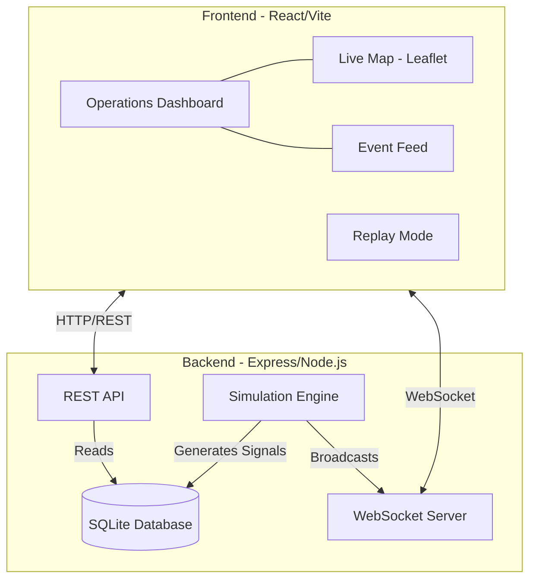

# BeaconScope

BeaconScope is a real-time, full-stack beacon monitoring and incident response console. It simulates a global network of receiver stations detecting distress signals from aviation, marine, and personal locator beacons, aggregating them into actionable incidents for search and rescue (SAR) operators.

## Architecture



## Features

- **Live Operations Dashboard**: A map-centric view showing real-time incidents, receiver stations, and signal events.
- **Real-Time Telemetry**: WebSockets stream new detections, confidence updates, and incident resolutions instantly.
- **Incident Directory**: Search, filter, and review historical and active incidents.
- **Timeline Replay**: Scrub through the detection history of an incident to see how confidence and estimated position evolved over time.
- **Infrastructure Health**: Monitor the status, packet delay, and heartbeat of the global receiver network.
- **Operational Analytics**: View system performance, active incident counts, and false positive rates.

## Tech Stack

- **Frontend**: React 18, Vite, Tailwind CSS, Lucide React, React-Leaflet, Recharts, date-fns.
- **Backend**: Express, Node.js, `ws` (WebSockets), `better-sqlite3`.
- **Database**: SQLite (in-memory/file-based for easy setup).

## Local Setup

1. Install dependencies:
   ```bash
   npm install
   ```

2. Start the development server (runs both backend and frontend):
   ```bash
   npm run dev
   ```

3. Open `http://localhost:3000` in your browser.

## Linear workflow

This repo uses a Linear state policy to keep issue status aligned with PR lifecycle:

- `Todo` → scoped but not started
- `In Progress` → implementation underway on a working branch
- `In Review` → PR is open and the Linear issue has a PR URL + branch comment
- `Done` → PR merged and any needed verification captured

See [`docs/linear-pr-traceability-workflow.md`](docs/linear-pr-traceability-workflow.md) for the full policy, Symphony auto-comment expectation, and the manual fallback checklist.

## Data Model

- **Beacons**: Physical devices (EPIRB, ELT, PLB) that emit signals.
- **Receiver Stations**: Ground or satellite stations that detect beacon signals.
- **Signal Events**: Individual detections of a beacon by a receiver station.
- **Incidents**: Aggregated signal events representing a localized distress situation. Confidence scores increase as more signals are received.

## Simulation Engine

The backend includes a simulation engine that continuously generates realistic beacon distress signals and receiver detections. It simulates:
- Signal drift (marine beacons moving with currents).
- Confidence score evolution (increasing as more receivers detect the signal).
- Receiver station health (occasional degraded or offline states).
- False positives and test beacon activations.
